# 🎓 AI Study Buddy – AI-Powered Learning Platform


An AI-powered study assistant built with **React, TypeScript, Firebase, and Google Gemini AI** to help students learn smarter. AI Study Buddy provides an intelligent tutor, quiz generation, note summarization, flashcards, OCR text extraction, voice interaction, and cloud synchronization—all in one modern application.

## 🌐 Live Demo

🚀 **Try AI Study Buddy here:**

**https://ai-study-buddy-production-c9b4.up.railway.app/**

---

---

## ✨ Features

* 🤖 AI Chat Tutor powered by Gemini AI
* 📝 AI Notes Summarizer
* ❓ AI Quiz Generator
* 🗂️ Flashcards
* 📷 OCR Scanner
* 🎤 Voice Tutor
* 📅 Study Planner
* 📚 Chat History
* 🔖 Bookmark Important Chats
* ☁️ Firebase Cloud Backup
* 🔐 Firebase Authentication
* 🌙 Dark Mode Support
* 👤 User Profile & Progress Tracking
* 🏆 XP, Level & Study Statistics

---

## 🛠️ Tech Stack

### Frontend

* React
* TypeScript
* Vite
* Tailwind CSS

### Backend & Cloud

* Firebase Authentication
* Cloud Firestore

### Artificial Intelligence

* Google Gemini AI API

### Other Libraries

* Lucide React
* Web Speech API
* OCR Integration

---

## 📸 Screenshots

### 🔐 Authentication

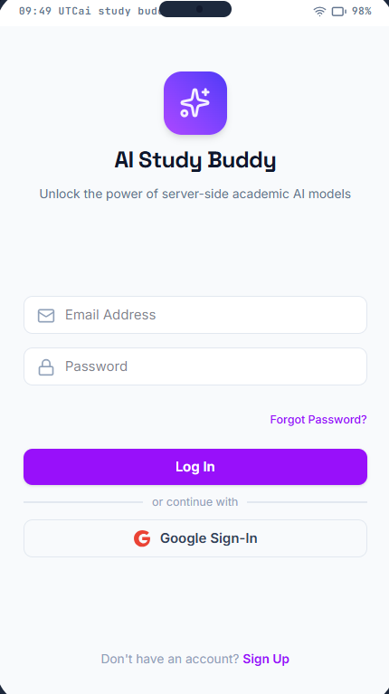


### 🏠 Home Dashboard

| Home Screen | Dashboard |
|-------------|-----------|
| 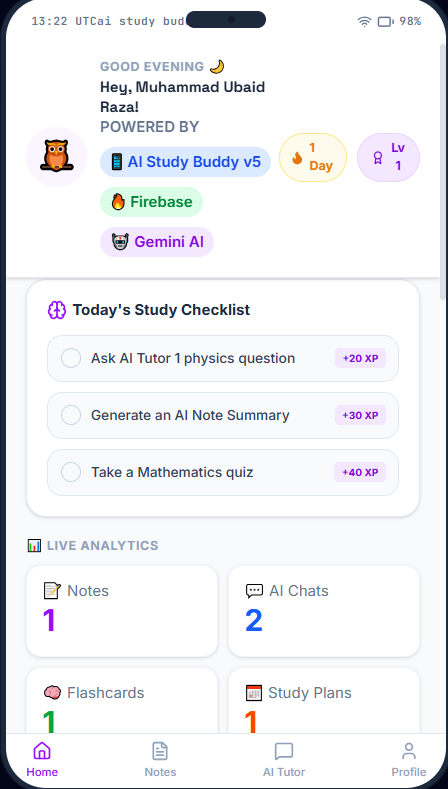 | 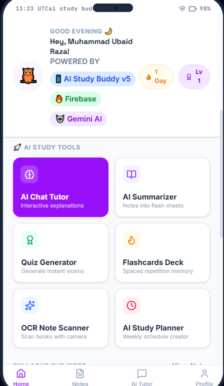 |

---

### 🤖 AI Chat Tutor

| Chat | AI Response |
|------|-------------|
| 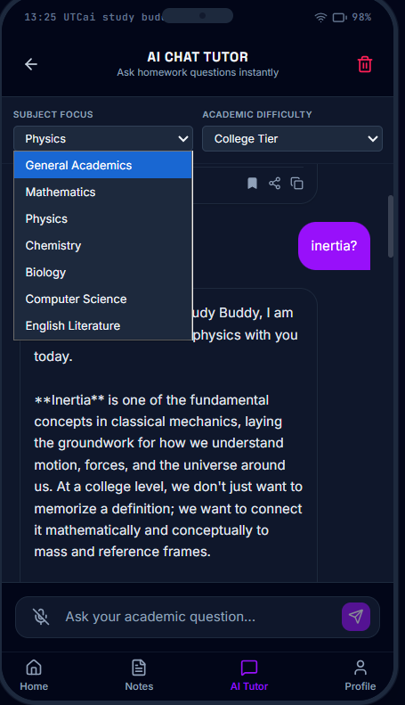 | 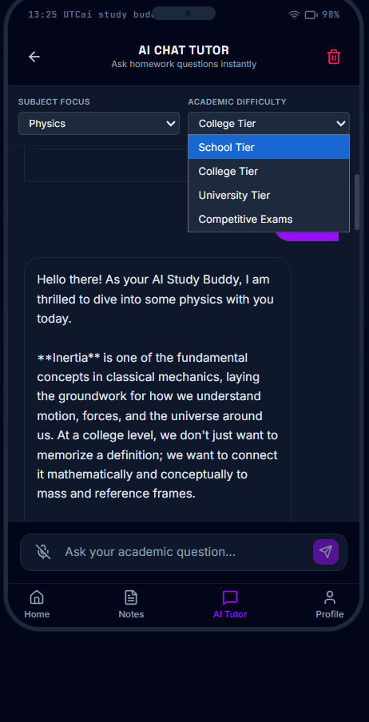 |

---

### 📝 AI Notes Summarizer

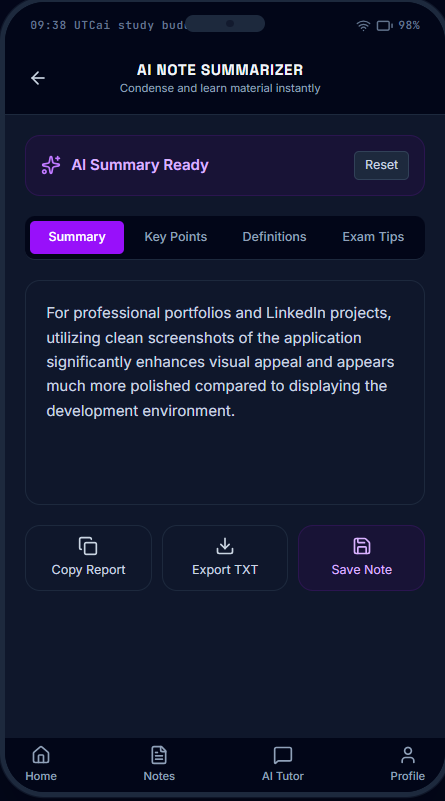

---

### 🗂️ AI Flashcards

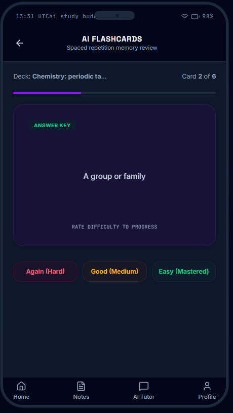

---

### ❓ AI Quiz Generator

| Quiz | Quiz Result |
|------|-------------|
| 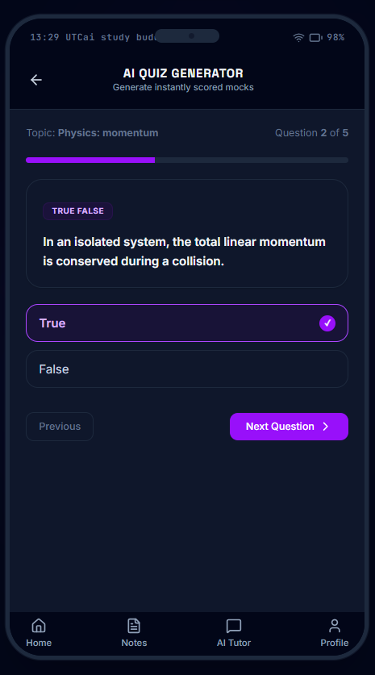 | 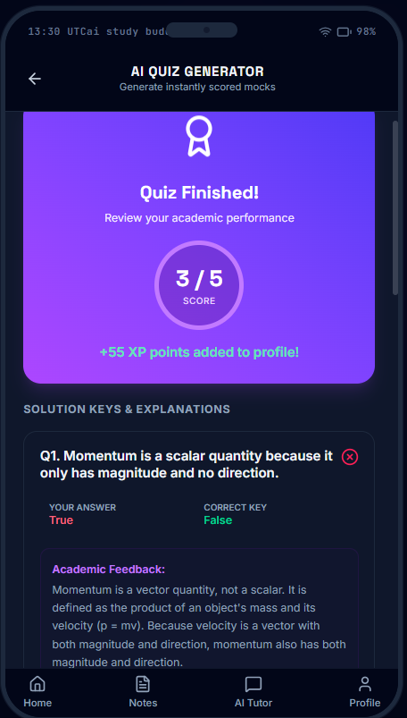 |

---

### 📷 OCR Scanner

| Scanner | Extracted Text |
|---------|----------------|
| 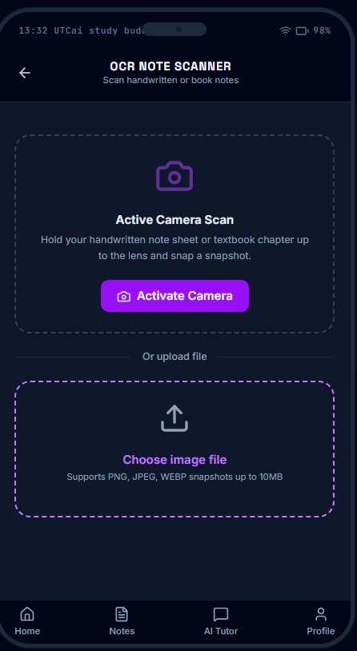 | 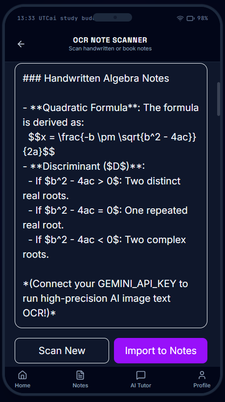 |

---

### 📅 Study Planner

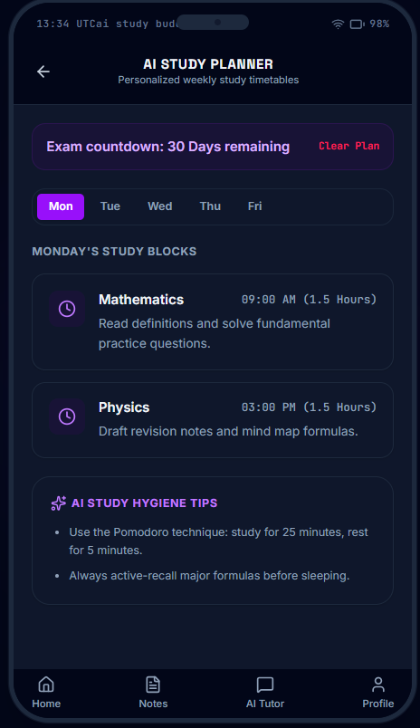

---

### 📚 Subjects

| Subjects | Subject Details |
|----------|-----------------|
| 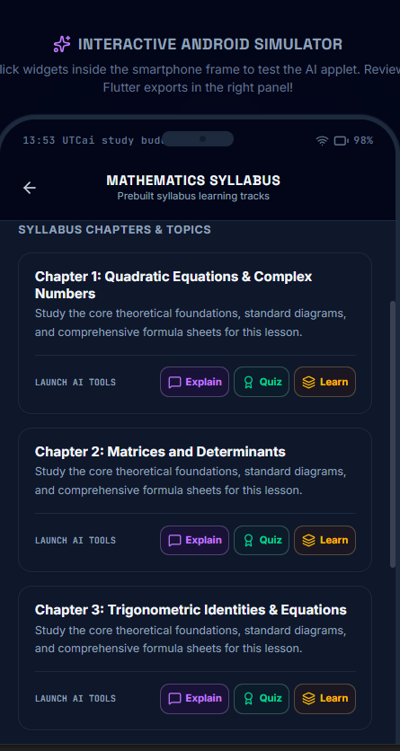 | 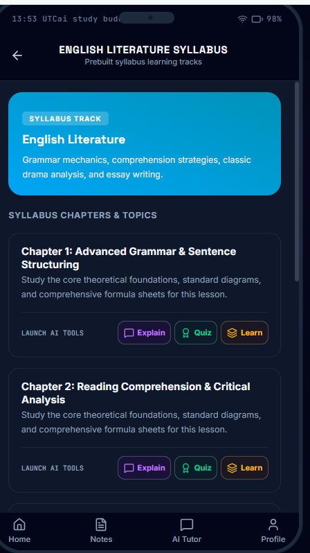 |

---


## 📂 Project Structure

```text
src/
 ├── components/
 ├── lib/
 ├── types.ts
 ├── App.tsx
 ├── main.tsx

server.ts
package.json
vite.config.ts
```

---

## 🚀 Installation

Clone the repository:

```bash
git clone https://github.com/seubaidraza-sir/AI-Study-Buddy.git
```

Move into the project:

```bash
cd AI-Study-Buddy
```

Install dependencies:

```bash
npm install
```

Create a `.env.local` file and add your Firebase and Gemini configuration.

Start the development server:

```bash
npm run dev
```

---

## 🔥 Firebase Features

* User Authentication
* Cloud Firestore Database
* Chat History Storage
* Bookmark Synchronization
* User Profiles
* Cloud Data Backup

---

## 🤖 AI Features

* Intelligent Question Answering
* Step-by-Step Explanations
* Academic Assistance
* Quiz Generation
* Smart Note Summarization
* Context-Aware Conversations

---

## 🎯 Future Improvements

* Android APK
* Offline Mode
* PDF Upload
* Image Question Solving
* AI Study Recommendations
* Push Notifications
* Multi-language Support
* Live Collaboration

---

## 👨‍💻 Author

**Muhammad Ubaid Raza**

BS Software Engineering  
UET Lahore

**GitHub:**  
https://github.com/seubaidraza-sir

**Repository:**  
https://github.com/seubaidraza-sir/AI-Study-Buddy

**Live Demo:**  
https://ai-study-buddy-production-c9b4.up.railway.app/
## ⭐ Support

If you found this project useful, consider giving it a ⭐ on GitHub.
